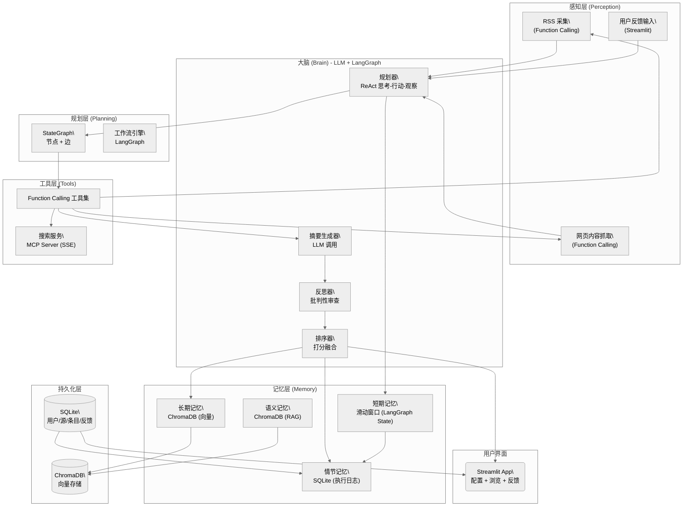

# FeedLens — 智能信息简报 Agent

## MVP 设计方案

| 项目 | 内容 |
|------|------|
| 作者 | Codex (via 架构设计方案) |
| 日期 | 2026-06-17 |
| 版本 | v1.0 MVP |
| 目标岗位 | AI 应用开发（简历项目） |

---

## 一、系统架构图




---

## 二、Agent 工作流设计（LangGraph StateGraph）

### State 定义

```python
from typing import TypedDict, List, Optional
from dataclasses import dataclass, field
from datetime import datetime
from enum import Enum

class SourceType(str, Enum):
    RSS = "rss"
    SEARCH = "search"

class FeedbackType(str, Enum):
    LIKE = "like"
    DISLIKE = "dislike"

@dataclass
class Source:
    source_id: str
    type: SourceType
    name: str
    url: Optional[str] = None
    query: Optional[str] = None
    config: dict = field(default_factory=dict)

@dataclass
class RawItem:
    item_id: str
    source_id: str
    title: str
    url: str
    content: str
    published: Optional[datetime] = None
    embedding: Optional[List[float]] = None

@dataclass
class DedupedItem(RawItem):
    duplicates: List[str] = field(default_factory=list)
    related_items: List[str] = field(default_factory=list)
    is_primary: bool = True

@dataclass
class ScoredItem(DedupedItem):
    relevance_score: float = 0.0
    recency_score: float = 0.0
    preference_score: float = 0.0
    final_score: float = 0.0
    importance_label: str = "normal"

class FeedLensState(TypedDict):
    session_id: str
    user_id: str
    domains: List[str]
    sources: List[Source]
    raw_items: List[RawItem]
    deduped_items: List[DedupedItem]
    scored_items: List[ScoredItem]
    digest: Optional[str]
    user_feedback: List[Feedback]
    execution_history: List[dict]
    errors: List[str]
    conversation_window: List[dict]
```

### 节点与边


### 各节点详细说明

| 节点 | 职责 | 调用资源 | 条件分支 |
|------|------|----------|----------|
| init_session | 加载用户配置、偏好 | SQLite + ChromaDB | - |
| collect_sources | 获取RSS源/搜索关键词 | SQLite(源表) | - |
| fetch_content | 并行采集内容 | rss_fetch/web_fetch | 源全失败则跳过 |
| deduplicate | embedding去重 | ChromaDB相似度检索 | - |
| rank_items | 融合打分+标记重要性 | ChromaDB偏好向量 | - |
| generate_digest | LLM生成结构化简报 | LLM API | - |
| reflect | 审查简报质量 | LLM API | 不合格->返回generate_digest |
| push_digest | 展示简报 | Streamlit | - |
| collect_feedback | 接收点赞/踩 | SQLite | - |
| update_preferences | 更新偏好向量 | ChromaDB + SQLite | - |

---

## 三、工具清单

### 3.1 RSS 采集工具（Function Calling）

| 属性 | 值 |
|------|-----|
| 名称 | rss_fetch |
| 选择理由 | 简单HTTP+XML解析，无需跨进程复用 |
| Parameters | feeds: List[str], max_per_feed: int(默认10) |

### 3.2 网页内容抓取（Function Calling）

| 属性 | 值 |
|------|-----|
| 名称 | web_fetch |
| 选择理由 | 单一URL抓取+提取，无需独立部署 |
| Parameters | url: str |

### 3.3 搜索服务（MCP, SSE）

| 属性 | 值 |
|------|-----|
| 名称 | web_search |
| 选择理由 | API Key/限频管理需独立进程；可跨Agent复用 |
| MCP部署 | SSE协议，Python MCP SDK实现 |
| Parameters | query: str, max_results: int(默认5) |

### 3.4 文本摘要（Function Calling）

| 属性 | 值 |
|------|-----|
| 名称 | summarize_text |
| 选择理由 | LLM API封装，内核内完成 |
| Parameters | text: str, max_length: int(默认200) |

### 3.5 简报生成（Function Calling）

| 属性 | 值 |
|------|-----|
| 名称 | generate_digest |
| 选择理由 | LLM API封装 |
| Parameters | items: List[ScoredItem], domains: List[str] |

### 3.6 推送通知（MCP, SSE）

| 属性 | 值 |
|------|-----|
| 名称 | push_notification |
| 选择理由 | 多种推送渠道需统一管理层；跨Agent复用 |
| MCP部署 | SSE协议，MVP阶段输出到Streamlit |

### 3.7 向量检索（Function Calling）

| 属性 | 值 |
|------|-----|
| 名称 | vector_search |
| 选择理由 | ChromaDB是本地库操作，无需独立部署 |
| Parameters | query_embedding: List[float], collection: str, top_k: int |

### 3.8 偏好更新（Function Calling）

| 属性 | 值 |
|------|-----|
| 名称 | update_user_preference |
| 选择理由 | SQLite+ChromaDB直接写入 |
| Parameters | user_id, item_embedding, feedback_type |


---

## 四、记忆系统设计

### 4.1 记忆层次

| 记忆类型 | 存储介质 | 存储内容 | 检索方式 | 更新策略 |
|----------|---------|---------|---------|---------|
| 短期记忆 | LangGraph State(内存) | 最近10轮交互 | 滑动窗口 | FIFO淘汰，满10轮压缩为摘要 |
| 长期记忆 | ChromaDB | 用户偏好向量、条目embedding | 余弦相似度检索 | 每次反馈增量调整 |
| 情节记忆 | SQLite | 执行轨迹(节点名、耗时、状态) | 按session_id查询 | 每次执行写一条 |
| 语义记忆 | ChromaDB | 领域知识embedding | RAG检索 | 批量预载+反馈扩充 |

### 4.2 短期记忆管理

- 滑动窗口：10轮(turn)
- 超出窗口的早期对话 -> 增量总结压缩(LLM生成摘要)
- 每个turn：{role, content, tool_calls, tool_results}

### 4.3 ChromaDB集合

| Collection | 用途 |
|-----------|------|
| user_preferences | 用户偏好向量 {user_id, preference_vector} |
| items | 已处理条目向量 {item_id, content_embedding, timestamp} |
| domain_knowledge | 语义记忆 {domain, concept, embedding} |

---

## 五、排序算法设计

### 5.1 综合打分公式

```
final_score = w1 * relevance + w2 * recency + w3 * preference
```

| 分量 | 计算方式 | 说明 |
|------|---------|------|
| relevance | cos_sim(item_embedding, domain_centroid) | 与关注领域相似度 |
| recency | exp(-0.5 * delta_t_in_days) | 半衰期约1.4天 |
| preference | cos_sim(item_embedding, user_preference_vector) | 与历史偏好接近程度 |

### 5.2 权重

| 阶段 | w1 | w2 | w3 |
|------|:--:|:--:|:--:|
| 初始(无历史数据) | 0.60 | 0.30 | 0.10 |
| 有10+条反馈后 | 0.40 | 0.20 | 0.40 |

### 5.3 重要性标签

| 标签 | 阈值 |
|------|------|
| critical | >= 0.85 |
| high | 0.70 - 0.85 |
| normal | 0.50 - 0.70 |
| low | < 0.50 |

---

## 六、去重策略设计

### 6.1 核心流程

1. 对每条内容生成embedding
2. 在ChromaDB查询相似历史条目
3. 相似度>=0.85 -> 标记为duplicate，保留最优那条
4. 相似度[0.65, 0.85) -> 标记为related(同事件不同角度)
5. 相似度<0.65 -> 全新内容

### 6.2 阈值校准

- 人工校准：用户反馈"重复" -> 降低对应来源阈值-0.02
- 自动校准：连续5次false positive -> 全局微调+/-0.01
- 初始化：对50条标注集跑ROC曲线选最优阈值

### 6.3 同事件不同角度

- LLM判断related组是否同一事件
- 同一事件->合并为多源条目，source_diversity_bonus = +0.05


---

## 七、数据模型（SQLite）

```sql
CREATE TABLE users (
    user_id        TEXT PRIMARY KEY,
    name           TEXT NOT NULL,
    domains        TEXT NOT NULL,           -- JSON数组
    preferences    TEXT,
    preference_vector_id TEXT,
    created_at     TEXT DEFAULT (datetime('now')),
    updated_at     TEXT DEFAULT (datetime('now'))
);

CREATE TABLE sources (
    source_id      TEXT PRIMARY KEY,
    user_id        TEXT NOT NULL REFERENCES users(user_id),
    type           TEXT NOT NULL CHECK(type IN (''rss'', ''search'')),
    name           TEXT NOT NULL,
    url            TEXT,
    query          TEXT,
    config         TEXT DEFAULT ''{}'',
    enabled        INTEGER DEFAULT 1,
    created_at     TEXT DEFAULT (datetime('now')),
    last_fetched   TEXT
);

CREATE TABLE items (
    item_id        TEXT PRIMARY KEY,
    source_id      TEXT NOT NULL REFERENCES sources(source_id),
    title          TEXT NOT NULL,
    url            TEXT,
    content        TEXT,
    summary        TEXT,
    embedding_id   TEXT,
    published      TEXT,
    fetched_at     TEXT DEFAULT (datetime('now')),
    digest_included INTEGER DEFAULT 0,
    duplicate_of   TEXT REFERENCES items(item_id),
    is_primary     INTEGER DEFAULT 1
);
CREATE INDEX idx_items_published ON items(published DESC);
CREATE INDEX idx_items_source ON items(source_id);

CREATE TABLE item_relations (
    relation_id    TEXT PRIMARY KEY,
    item_id_a      TEXT NOT NULL REFERENCES items(item_id),
    item_id_b      TEXT NOT NULL REFERENCES items(item_id),
    relation_type  TEXT NOT NULL CHECK(relation_type IN (''duplicate'', ''related'', ''same_event'')),
    similarity     REAL,
    created_at     TEXT DEFAULT (datetime('now'))
);

CREATE TABLE feedback (
    feedback_id    TEXT PRIMARY KEY,
    item_id        TEXT NOT NULL REFERENCES items(item_id),
    user_id        TEXT NOT NULL REFERENCES users(user_id),
    feedback_type  TEXT NOT NULL CHECK(feedback_type IN (''like'', ''dislike'', ''read'', ''irrelevant'')),
    created_at     TEXT DEFAULT (datetime('now')),
    UNIQUE(item_id, user_id)
);

CREATE TABLE digests (
    digest_id      TEXT PRIMARY KEY,
    user_id        TEXT NOT NULL REFERENCES users(user_id),
    title          TEXT,
    content        TEXT,
    summary        TEXT,
    item_count     INTEGER DEFAULT 0,
    generated_at   TEXT DEFAULT (datetime('now')),
    pushed_at      TEXT,
    feedback_count INTEGER DEFAULT 0
);

CREATE TABLE digest_items (
    digest_id      TEXT NOT NULL REFERENCES digests(digest_id),
    item_id        TEXT NOT NULL REFERENCES items(item_id),
    rank_position  INTEGER,
    score          REAL,
    importance_tag TEXT DEFAULT ''normal'',
    PRIMARY KEY (digest_id, item_id)
);

CREATE TABLE execution_logs (
    log_id         TEXT PRIMARY KEY,
    session_id     TEXT NOT NULL,
    node_name      TEXT NOT NULL,
    status         TEXT NOT NULL CHECK(status IN (''running'', ''success'', ''error'')),
    started_at     TEXT NOT NULL,
    ended_at       TEXT,
    error          TEXT,
    output_summary TEXT,
    items_processed INTEGER DEFAULT 0
);
```


---

## 八、技术栈选择

| 层级 | 技术 | 选择理由 |
|------|------|---------|
| Agent框架 | LangGraph >=0.2.0 | 用户指定；StateGraph支持复杂工作流 |
| LLM API | DeepSeek / 通义千问 | 国内可用，无需科学上网 |
| 向量数据库 | ChromaDB >=0.5.0 | 嵌入式，零运维，适合单机MVP |
| 关系数据库 | SQLite(Python内置) | 零部署，单文件 |
| 前端 | Streamlit >=1.35 | 快速出原型 |
| RSS解析 | feedparser | Python最成熟RSS解析库 |
| 网页抓取 | httpx + beautifulsoup4 | 支持异步并发+灵活解析 |
| 内容提取 | readability-lxml / trafilatura | 去除导航/广告，提取正文 |
| Embedding | sentence-transformers(本地) | 推荐paraphrase-multilingual-MiniLM-L12-v2 |
| MCP SDK | mcp(Python SDK) | 官方SDK，支持SSE/stdio |
| 定时调度 | APScheduler | 纯Python，支持cron表达式 |

推荐模型：摘要/简报/反思 -> DeepSeek-V3或通义千问2.5；Embedding -> paraphrase-multilingual-MiniLM-L12-v2

---

## 九、MVP范围界定

### MVP必须实现

- 用户配置关注领域（Streamlit UI）
- 预设RSS源 + 用户自定义RSS源
- RSS内容采集与正文提取
- 向量相似度去重
- LLM文本摘要生成
- 结构化每日简报（按领域分类+重要性标注+来源引用）
- Streamlit前端（配置页+简报列表页+详情页）
- 用户反馈（点赞/点踩）
- 偏好学习（反馈更新偏好向量）
- SQLite持久化 + ChromaDB索引

### 后续迭代

- 搜索源采集（MCP Search Server）
- IM推送（飞书/企微 MCP Push Server）
- 定时自动执行（APScheduler）
- 排序权重自学习
- 情节记忆反思
- 多用户支持
- 多语言简报


---

## 十、阶段性目标与任务拆解

### 阶段P0：项目脚手架与基础架构（依赖：无 | 复杂度：低）

**目标**：搭建完整项目骨架，各组件能独立运行。

**交付物**：
- FeedLens_Agent/ 完整目录结构
- requirements.txt（锁定版本）
- .env.example（配置模板）
- streamlit app.py 空壳
- database.py（SQLite建表脚本，python database.py init执行）
- vector_store.py（ChromaDB初始化）
- graph.py（LangGraph StateGraph骨架，仅状态定义+空节点函数+可编译）

**关键任务**：
1. 创建项目目录结构
2. 编写requirements.txt，安装验证
3. database.py -> 建表DDL+连接器+初始化CLI
4. vector_store.py -> ChromaDB客户端+集合管理
5. graph.py -> FeedLensState定义+节点函数桩+Graph编译
6. app.py -> Streamlit最小骨架

**验证方式**：
- python database.py init -> SQLite文件建完所有表
- streamlit run app.py -> 页面正常渲染

---

### 阶段P1：信息采集流水线（依赖：P0 | 复杂度：低）

**目标**：从RSS源采集内容，存入SQLite，支持预置源和自定义源。

**交付物**：
- tools/rss_fetch.py（Function Calling风格RSS采集工具）
- tools/web_fetch.py（Function Calling风格正文提取工具）
- sources.yaml（5-8个优质中文RSS源，覆盖AI/科技/新能源）
- Streamlit页面：RSS源管理（增删feed URL、手动触发采集）
- 采集内容存入items表

**关键任务**：
1. rss_fetch.py -> def rss_fetch(feeds, max_per_feed)
2. web_fetch.py -> def web_fetch(url)（httpx+readability）
3. 构建sources.yaml预置源
4. Streamlit源管理页面+采集按钮
5. LangGraph节点fetch_content

**验证方式**：
- Streamlit添加RSS源->采集->数据写入items表
- 控制台独立验证rss_fetch输出结构化数据

---

### 阶段P2：去重与摘要（依赖：P1 | 复杂度：中）

**目标**：对采集条目进行向量去重，用LLM生成摘要。

**交付物**：
- tools/embedding.py（sentence-transformers本地embedding）
- tools/deduplicate.py（ChromaDB相似度查询+阈值判定）
- tools/summarize.py（LLM摘要生成，Function Calling风格）
- LangGraph节点：deduplicate, summarize
- 验证脚本：输入10条模拟数据->输出去重后6-7条+每条200字摘要

**关键任务**：
1. 下载配置sentence-transformers模型
2. embedding.py -> def generate_embedding(text)
3. deduplicate.py -> def deduplicate(items, threshold=0.85)
4. summarize.py -> 封装LLM API调用
5. 将去重+摘要接入LangGraph工作流

**验证方式**：
- 两段相似度0.90文本->标记为duplicate
- 两段相似度0.70文本->标记为related
- 摘要工具输出200字可读摘要


### 阶段P3：简报生成与前端展示（依赖：P2 | 复杂度：中）

**目标**：将去重摘要后的条目组装成结构化简报，通过Streamlit展示。

**交付物**：
- tools/digest_generator.py（LLM组装结构化简报）
- tools/ranker.py（融合打分：相关性+时效性+偏好）
- tools/reflector.py（LLM审查简报质量，不合格则重做）
- LangGraph节点：rank_items, generate_digest, reflect, push_digest
- Streamlit简报页：分类折叠+重要性颜色+来源引用
- Streamlit领域配置页

**关键任务**：
1. ranker.py -> 排序算法实现
2. digest_generator.py -> LLM提示词（Markdown结构化输出）
3. reflector.py -> 反思提示词（完整性、去重遗漏、可追溯性）
4. Streamlit简报展示组件
5. 完整跑通P1->P2->P3工作流链

**验证方式**：
- 一键触发从采集到展示完整工作流
- 简报结构：标题->领域分类->每条含(重要性标签+标题+摘要+来源链接)

---

### 阶段P4：用户反馈与偏好学习（依赖：P3 | 复杂度：中）

**目标**：用户对简报条目反馈(点赞/踩)，Agent学习调整后续排序。

**交付物**：
- tools/feedback_handler.py（SQLite+ChromaDB更新）
- tools/preference_learner.py（偏好向量增量更新）
- LangGraph节点：collect_feedback, update_preferences
- Streamlit反馈交互按钮
- 验证：某领域偏好变高后同领域条目排序上升

**关键任务**：
1. feedback_handler.py -> 反馈->写入feedback表->更新偏好
2. preference_learner.py -> 偏好向量增量更新公式
3. Streamlit简报条目反馈按钮
4. init_session节点中的偏好加载流程

**验证方式**：
- 点赞某领域条目->下一轮同领域条目排序提升
- 点踩->排序下降
- SQLite feedback表记录完整

---

### 阶段P5：定时调度与持久化（依赖：P4 | 复杂度：低）

**目标**：定时自动执行+完整情节记忆。

**交付物**：
- scheduler.py（APScheduler每日定时，默认8:00）
- harness.py（session->turn->event三层框架）
- 情节记忆（每次执行写入execution_logs）
- Streamlit历史简报列表+执行日志页面

**关键任务**：
1. scheduler.py -> 每日定时任务注册
2. harness.py -> Session生命周期+Turn状态跟踪
3. Streamlit历史简报导航+日志页
4. 30天数据清理策略

**验证方式**：
- 调度器定时自动触发工作流
- 每次执行execution_logs完整记录
- 历史简报可回溯翻阅

---

### 阶段P6：工程化与部署（依赖：P5 | 复杂度：低）

**目标**：项目可演示，适合简历展示。

**交付物**：
- 完整README.md（架构图+安装步骤+截图）
- 单元测试覆盖率>60%
- 部署文档
- 简历项目描述模板

**关键任务**：
1. README.md -> 架构图+快速开始+截图
2. 核心模块单元测试（去重、排序、CRUD）
3. 配置管理优化
4. 部署文档+简历描述


---

## 十一、阶段依赖关系

P0(脚手架) -> P1(信息采集) -> P2(去重摘要) -> P3(简报展示) -> P4(反馈学习) -> P5(定时调度) -> P6(工程化)

每个阶段独立可验证，前一阶段完成后才能开始下一阶段。

---

## 十二、项目目录结构（MVP终态）

```
FeedLens_Agent/
├── README.md
├── MVP_DESIGN.md
├── requirements.txt
├── .env.example
├── feedlens/                   # 主包
│   ├── __init__.py
│   ├── config.py               # 配置加载
│   ├── database.py             # SQLite连接与建表
│   ├── vector_store.py         # ChromaDB客户端
│   ├── graph.py                # LangGraph StateGraph
│   ├── state.py                # TypedDict+dataclass
│   ├── harness.py              # session->turn->event
│   ├── scheduler.py            # APScheduler
│   ├── tools/                  # 工具模块(10个)
│   │   ├── rss_fetch.py
│   │   ├── web_fetch.py
│   │   ├── embedding.py
│   │   ├── deduplicate.py
│   │   ├── summarize.py
│   │   ├── ranker.py
│   │   ├── digest_generator.py
│   │   ├── reflector.py
│   │   ├── feedback_handler.py
│   │   └── preference_learner.py
│   └── mcp/                    # MCP Server
│       ├── __init__.py
│       └── search_server.py
├── data/                       # 运行时数据
├── app.py                      # Streamlit入口
├── pages/                      # Streamlit多页面
│   ├── sources.py
│   ├── digest.py
│   ├── history.py
│   ├── config.py
│   └── logs.py
├── tests/
└── samples/
    └── sample_feeds.yaml
```

---

## 十三、工具调用方式决策总表

| 工具 | 调用方式 | 数量 | 理由 |
|------|---------|:----:|------|
| rss_fetch, web_fetch, summarize, digest_generator, ranker, deduplicate, embedding, feedback_handler, preference_learner, reflector | Function Calling | 10 | 逻辑简单、本地执行、无需跨进程 |
| web_search, push_notification | MCP (SSE) | 2 | API Key/限频管理/多通道统一，需独立进程，可跨Agent复用 |
| **合计** | | **12** | **10个FC + 2个MCP** |

---

## 十四、风险与缓解措施

| 风险 | 缓解措施 |
|------|---------|
| 中文RSS源不稳定 | 预置8-10个源，YAML配置可修改 |
| sentence-transformers模型下载慢 | 首次自动下载+进度条；备选LLM API做embedding |
| LLM API成本 | 使用DeepSeek(价格低)；摘要缓存避免重复调用 |
| ChromaDB兼容性 | 先纯Python验证embedding格式再集成 |
| Streamlit状态管理 | st.session_state+SQLite真相源 |

---

## 附录：用户交互流程

```
首次使用:
  打开Streamlit -> 配置领域(如"AI Agent"、"新能源车")
  -> 选择预置RSS源或自定义 -> 点击"立即生成简报"

Agent执行:
  采集 -> 去重 -> 摘要 -> 排序 -> 简报生成 -> 反思

用户看到:
  【FeedLens每日简报】2026-06-17
  [AI Agent] Anthropic发布新版Claude   [+1] [不相关]
    摘要: Anthropic更新了Claude的function calling能力...
    来源: 机器之心
  [新能源车] 宁德时代发布第三代电池   [+1] [不相关]
    摘要: 能量密度提升30%，2026年量产...
    来源: 36氪

用户点击[+1] -> Agent记录偏好 -> 下次类似内容排名提升
```

---

*文档结束*
