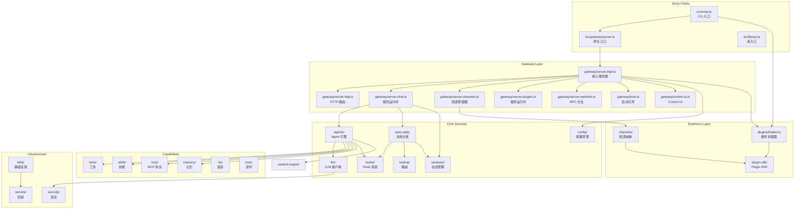
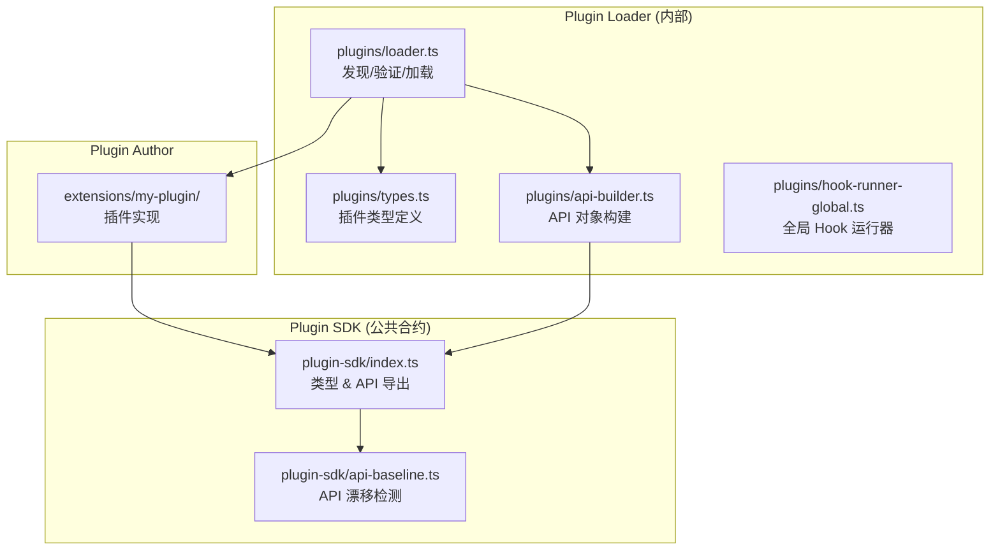
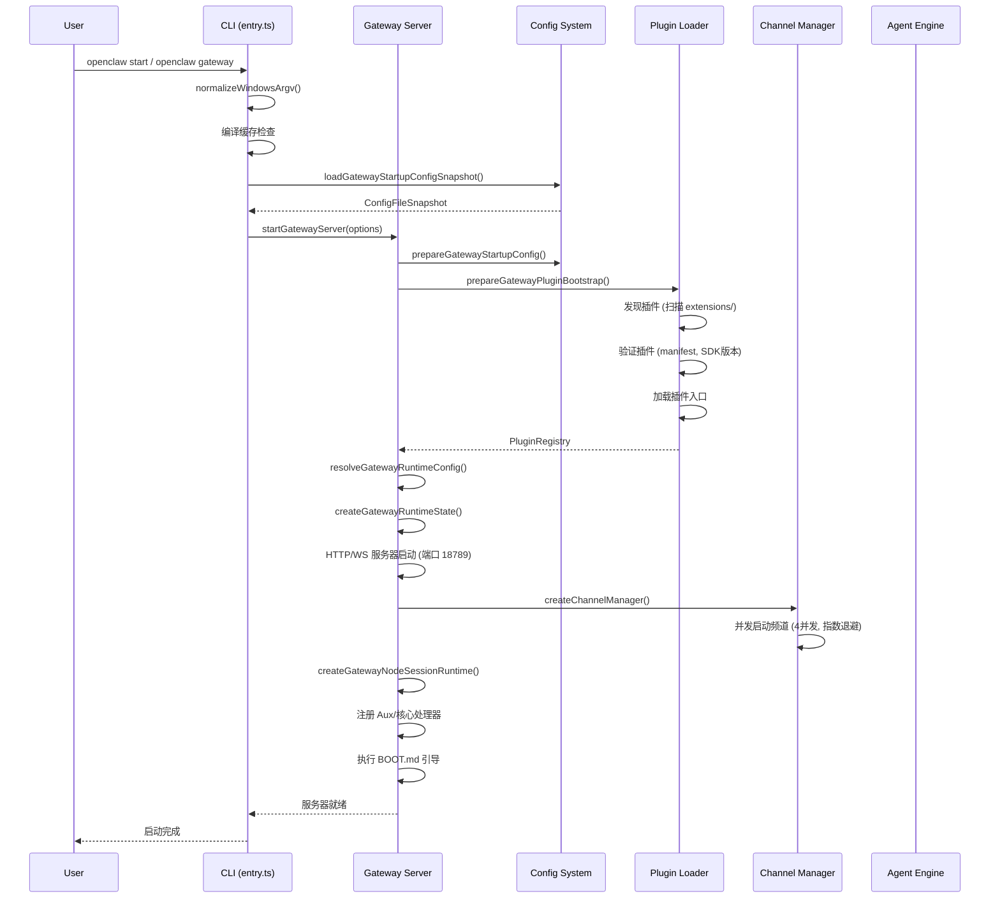
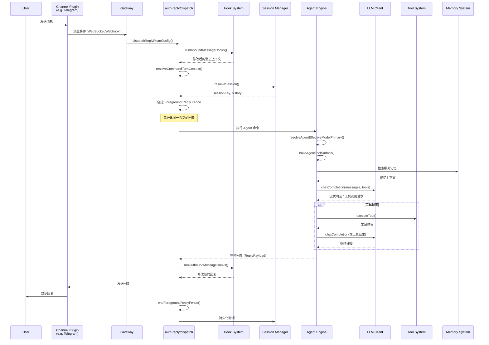

# OpenClaw 技术架构文档

> **文档版本**: 基于 `2026.6.8` 版本源码分析  
> **项目仓库**: <https://github.com/openclaw/openclaw>  
> **许可证**: MIT  

---

## 目录

1. [项目概述](Technical%20Architecture.md#1-项目概述)
2. [整体架构](Technical%20Architecture.md#2-整体架构)
3. [核心模块详解](Technical%20Architecture.md#3-核心模块详解)
4. [数据流与交互流程](Technical%20Architecture.md#4-数据流与交互流程)
5. [API 参考](Technical%20Architecture.md#5-api-参考)
6. [配置与部署](Technical%20Architecture.md#6-配置与部署)
7. [扩展与定制指南](Technical%20Architecture.md#7-扩展与定制指南)
8. [代码组织与风格](Technical%20Architecture.md#8-代码组织与风格)
9. [技术债务与改进建议](Technical%20Architecture.md#9-技术债务与改进建议)

---

## 1. 项目概述

### 1.1 项目目标与定位

**OpenClaw** 是一个**多通道 AI 网关（Multi-channel AI Gateway）**，定位为**个人 AI 助手（Personal AI Assistant）**。用户在自己的设备上运行它，通过日常使用的通讯渠道（消息应用）与之交互。

它不是一个纯粹的 Web 框架或中间件——它的核心产品是"助手体验"。Gateway（网关）是控制平面，真正的产品是运行在用户本地的、可跨渠道访问的 AI 助手。

### 1.2 核心功能摘要

| 功能域 | 说明 |
|--------|------|
| **多通道消息接入** | 支持 30+ 通讯渠道：WhatsApp、Telegram、Slack、Discord、Google Chat、Signal、iMessage、IRC、Microsoft Teams、Matrix、飞书、LINE、微信、QQ、WebChat 等 |
| **AI 模型路由** | 通过插件化 Provider 层支持 OpenAI、Anthropic、Google、AWS Bedrock、Ollama、vLLM 等 40+ 模型提供商 |
| **Agent 执行引擎** | 全功能 AI Agent，支持工具调用（Bash、文件系统、浏览器、Shell 命令等）、子 Agent 分发、技能系统 |
| **插件体系** | 完整的 Plugin SDK，支持频道插件（Channel Plugin）、Provider 插件、工具插件、Hook 扩展 |
| **MCP 协议支持** | 原生支持 Model Context Protocol，可接入外部工具/资源服务器 |
| **Control UI** | 内置 Web 控制界面，支持实时会话查看、Agent 管理 |
| **OpenAI 兼容 API** | 网关层暴露 OpenAI 兼容的 Chat Completions API，允许第三方应用无缝接入 |
| **Gateway RPC 体系** | 网关级 JSON-RPC 风格的方法注册表，覆盖 agents、channels、config、sessions、skills、tools 等 35+ 命名空间 |
| **会话与上下文管理** | 多 Agent 工作区、会话持久化、上下文引擎、长期记忆（Memory） |
| **语音与媒体** | TTS 语音合成、语音通话、媒体理解与生成、Canvas 画布 |

### 1.3 适用场景

- **个人 AI 助手**：在熟悉的通讯工具中与 AI 对话，无需额外 App
- **开发者的 AI 工作台**：通过多模型路由、Agent 工具链提升开发效率
- **团队协作网关**：统一管理多个 AI 提供商的接入、配额、审计
- **自动化工作流**：结合 Cron 定时任务、Webhook、技能系统构建自动化流程
- **AI 应用开发**：利用 Plugin SDK 和 Gateway RPC 构建自定义 AI 应用

---

## 2. 整体架构

### 2.1 架构风格

OpenClaw 采用 **分层插件化架构**（Layered Plugin Architecture），结合了以下架构范式：

- **插件化架构**：核心保持零插件依赖，所有功能通过 Plugin SDK 定义的合约扩展
- **事件驱动**：基于 Hook 系统的消息处理管线（接收 Hook → 处理 → 发送 Hook）
- **网关模式**：Gateway 作为统一入口，对外暴露 HTTP/WebSocket 接口，对内协调 Agent 和插件
- **Provider/Adapter 模式**：AI 模型提供商、消息渠道均通过适配器模式接入
- **命令分发模式**：CLI 采用 Commander 框架，支持核心命令 + 插件动态注册命令

### 2.2 顶层模块划分

```
openclaw-main/
├── src/                    # 核心 TypeScript 源码（70+ 子模块）
│   ├── gateway/            # 🌐 网关服务器（HTTP/WS/RPC/Control UI）
│   ├── agents/             # 🤖 Agent 执行引擎
│   ├── auto-reply/         # 💬 自动回复分发与调度
│   ├── channels/           # 📡 频道抽象层与插件注册表
│   ├── plugins/            # 🔌 插件加载器与 API 构建器
│   ├── plugin-sdk/         # 📦 公共 Plugin SDK 表面（类型导出）
│   ├── config/             # ⚙️ 配置加载、验证、迁移、默认值
│   ├── cli/                # 🖥️ CLI 命令系统
│   ├── llm/                # 🧠 LLM 客户端与模型路由
│   ├── hooks/              # 🪝 Hook 系统（消息/会话/生命周期）
│   ├── routing/            # 🔀 请求路由
│   ├── sessions/           # 💾 会话管理
│   ├── flows/              # 🔄 工作流
│   ├── context-engine/     # 📚 上下文引擎
│   ├── memory/             # 🗄️ 长期记忆（SQLite/LanceDB）
│   ├── mcp/                # 🔧 Model Context Protocol 支持
│   ├── skills/             # 🎯 技能系统
│   ├── tools/              # 🛠️ Agent 工具集
│   ├── security/           # 🔒 安全与沙箱
│   ├── commands/           # ⌨️ 命令解析
│   ├── cron/               # ⏰ 定时任务
│   ├── infra/              # 🏗️ 基础设施（网络、进程、诊断）
│   ├── secrets/            # 🔐 密钥管理
│   ├── tts/                # 🔊 语音合成
│   ├── talk/               # 🎙️ 语音通话
│   ├── media/              # 🖼️ 媒体处理
│   ├── transcripts/        # 📝 会话记录
│   ├── daemon/             # 👾 守护进程
│   ├── docs/               # 📖 内嵌文档
│   └── ...                 # 其他辅助模块
├── extensions/             # 🧩 插件扩展（138 个插件目录）
│   ├── telegram/           # Telegram 频道插件
│   ├── discord/            # Discord 频道插件
│   ├── whatsapp/           # WhatsApp 频道插件
│   ├── openai/             # OpenAI Provider 插件
│   ├── anthropic/          # Anthropic Provider 插件
│   ├── google/             # Google Gemini Provider
│   ├── ollama/             # Ollama 本地模型 Provider
│   ├── mcp/                # MCP 扩展（如 memory-lancedb）
│   └── ...                 # 100+ 其他插件
├── packages/               # 📦 独立包
│   ├── gateway-protocol/   # 网关协议定义
│   └── terminal-core/      # 终端核心工具
├── ui/                     # 🖥️ Control UI 前端源码
├── apps/                   # 📱 应用（iOS/Android/Desktop）
├── docs/                   # 📚 文档源（发布到 docs.openclaw.ai）
├── test/                   # 🧪 测试（409 个 .ts 测试文件）
├── config/                 # 📋 构建/工具配置
├── deploy/                 # 🚀 部署配置
└── scripts/                # 🔧 构建/发布脚本
```

### 2.3 模块间依赖关系



### 2.4 关键设计决策与 Trade-off

| 决策 | 说明 | Trade-off |
|------|------|-----------|
| **核心零插件依赖** | `src/` 不包含任何具体插件 ID、默认值或策略硬编码 | 增加抽象层复杂度，但保证了核心的可演进性 |
| **Plugin SDK 作为合约边界** | 插件只能通过 `plugin-sdk/*` 导入核心类型，不能直接引用 `src/**` | 版本兼容性由 SDK API 基线哈希检测，插件作者受合约约束 |
| **SQLite 作为主要存储** | 运行时状态、插件 KV、Agent 缓存全部使用 SQLite（通过 Kysely ORM） | 避免 JSON/JSONL 碎片化，统一迁移路径；代价是并发写入需谨慎 |
| **懒加载（Dynamic Import）** | 大量模块通过 `import()` 动态加载，减少启动时的依赖图体积 | 增加首次调用延迟，但显著优化了 CLI 启动速度 |
| **Gateway 模式** | 所有外部访问通过 Gateway HTTP/WS 入口，内部组件通过方法注册表通信 | 单点集中，但提供了统一的认证、审计、速率限制点 |
| **Config → Doctor → Runtime 三段式** | 配置变更先通过 `openclaw doctor --fix` 迁移，运行时只读取规范形状 | 避免了运行时兼容分支爆炸，但需要维护 doctor 迁移逻辑 |
| **Channel 仅传输层** | 频道插件只负责消息渲染/传输限制，不拥有产品命令树 | 避免了频道间逻辑重复，但频道特性差异大时适配复杂 |
| **Foreground Reply Fence** | 同一会话的自动回复通过 generation 机制串行化，防止并发回复冲突 | 保证消息顺序一致性，代价是吞吐量受限于同一会话 |

---

## 3. 核心模块详解

### 3.1 网关服务器 (`src/gateway/`)

#### 3.1.1 模块职责与边界

网关模块是整个 OpenClaw 的**运行时核心**，负责：

- 启动 HTTP/WebSocket 服务器
- 加载和引导插件注册表
- 创建频道管理器并启动频道账户
- 暴露 Control UI、OpenAI 兼容 API、Gateway RPC 方法
- 管理 Agent 会话生命周期
- 协调启动引导（BOOT.md 执行）
- 处理优雅关闭（drain → close）

**边界**：不拥有具体频道实现、不拥有 Provider 认证逻辑、不拥有 Agent 工具实现。

#### 3.1.2 主要类/接口/函数

| 文件 | 核心导出 | 职责 |
|------|----------|------|
| `server.ts` | `startGatewayServer(options)` | 公共入口，懒加载 `server.impl.ts` |
| `server.impl.ts` | `GatewayServer` 类 | 核心服务器实现，67KB |
| `server-http.ts` | HTTP 路由处理器 | Control UI、OpenAI API、WebSocket 升级 |
| `server-chat.ts` | `ChatRunState`, `SessionEventSubscriberRegistry` | 将 Agent 事件投射到聊天流 |
| `server-channels.ts` | `ChannelManagerOptions`, 退避策略 | 频道启动/停止/重启，指数退避重试 |
| `server-plugins.ts` | 插件运行时适配器 | 加载插件注册表，构建回退上下文 |
| `server-methods.ts` | 方法注册表聚合器 | 35+ RPC 命名空间的懒加载处理器 |
| `boot.ts` | BOOT.md 运行器 | 隔离的启动会话，执行工作区引导检查 |
| `call.ts` | `GatewayClient` | 网关 RPC 调用客户端 |
| `control-ui.ts` | Control UI HTTP 处理器 | 打包 UI 资源、引导配置、头像 |
| `server-runtime-state.ts` | 运行时状态工厂 | 构建 WebSocket 服务器、HTTP 服务器 |

#### 3.1.3 关键处理流程：服务器启动

```
startGatewayServer(options)
  │
  ├─ 1. createGatewayStartupTrace()          // 启动追踪
  ├─ 2. loadGatewayStartupConfigSnapshot()   // 加载配置快照
  ├─ 3. prepareGatewayStartupConfig()        // 认证引导
  ├─ 4. prepareGatewayPluginBootstrap()      // 插件引导
  ├─ 5. resolveGatewayRuntimeConfig()        // 解析运行时配置
  ├─ 6. createGatewayRuntimeState()          // 创建 HTTP/WS 运行时
  │     ├─ WebSocketServer (noServer 模式)
  │     ├─ HTTP 服务器
  │     └─ 预认证连接预算
  ├─ 7. createChannelManager()               // 频道管理器
  │     └─ 启动频道账户（并发度 4）
  │           └─ 退避策略: 初始5s, 最大5min, ×2, 最多10次
  ├─ 8. createGatewayNodeSessionRuntime()    // 节点会话运行时
  ├─ 9. 早期/后期运行时服务                   // aux handlers, core handlers
  └─ 10. 注册关闭处理程序                      // prelude, drain, close
```

#### 3.1.4 可配置项与扩展点

- `GatewayServerOptions`: `bind`, `host`, `controlUi`, `openAI`, `auth`, `tailscale`
- 插件通过 `ChannelPlugin.gatewayMethods` 注册自定义 RPC 方法
- 插件通过 `PluginHttpRequestHandler` / `PluginHttpUpgradeHandler` 注册 HTTP 路由
- 默认端口: `18789`（通过 `resolveGatewayPort` 解析）

#### 3.1.5 设计模式

- **外观模式**：`server.ts` 是公共入口，隐藏内部复杂实现
- **懒加载/按需初始化**：大量 `dynamic import()` 减少启动开销
- **策略模式**：退避策略、插件路由策略均可替换
- **观察者模式**：`SessionEventSubscriberRegistry` / `SessionMessageSubscriberRegistry`

---

### 3.2 Agent 执行引擎 (`src/agents/`)

#### 3.2.1 模块职责与边界

Agent 模块是 OpenClaw 的 **AI 推理核心**，负责：

- Agent 命令编排：会话、模型选择、交付计划
- 工具表面构建：核心工具、Shell 工具、频道工具、插件工具、MCP 工具
- 模型回退与选择：主模型选择、自动回退探测、子 Agent 模型配置
- Agent 作用域管理：工作区路径匹配、技能过滤、执行合约
- 子 Agent 生成与管理（ACP 协议）

**边界**：不拥有具体模型实现（由 Provider 插件提供）、不拥有具体工具实现（由 `tools/` 和插件提供）。

#### 3.2.2 主要文件与职责

| 文件 | 大小 | 核心职责 |
|------|------|----------|
| `agent-command.ts` | 86KB | 主 Agent 命令编排，50+ 依赖导入 |
| `agent-tools.ts` | 50KB | 构建有效工具表面，沙箱/策略/权限过滤 |
| `agent-scope.ts` | 625行 | Agent 作用域：模型选择、回退、技能、工作区 |
| `acp-spawn.ts` | 54KB | Agent Communication Protocol 子 Agent 生成 |
| `agent-tool-definition-adapter.ts` | - | 工具定义适配器 |

#### 3.2.3 关键算法：工具表面构建

```
buildAgentToolSurface(agent, context):
  1. 收集核心工具 (bash-tools, file-tools, etc.)
  2. 收集 Shell 工具
  3. 收集频道工具 (channel-tools)
  4. 收集 OpenClaw 内置工具 (openclaw-tools)
  5. 收集插件注册的工具 (plugin-tools)
  6. 收集 MCP 工具
  7. 收集工具搜索能力 (tool-search)
  8. 应用沙箱策略过滤
  9. 应用配置文件过滤
  10. 应用 Provider 过滤
  11. 应用发送者过滤
  12. 应用组策略过滤
  13. 应用子 Agent 策略
  14. 返回最终工具列表
```

#### 3.2.4 可配置项与扩展点

- `OpenClawConfig.agents`: Agent 定义、默认 Agent、工作区路径
- `OpenClawConfig.models`: 模型别名（opus、sonnet、gpt 等）、回退链
- `OpenClawConfig.tools`: 工具允许/拒绝列表
- `OpenClawConfig.skills`: 技能过滤器
- Plugin SDK: `registerTool()` / `registerAgentTool()` API

#### 3.2.5 典型调用流程

```
用户发送消息
  → Channel Plugin 接收
  → auto-reply/dispatch.ts
    → resolveCommandTurnContext()         // 解析会话上下文
    → deriveInboundMessageHookContext()   // Hook 上下文
    → dispatchReplyFromConfig()           // 分发回复
      → agent-command.ts                  // Agent 命令编排
        → agent-scope.ts: resolveAgentEffectiveModelPrimary()  // 模型选择
        → agent-tools.ts: 构建工具表面
        → LLM 调用 (llm/)
        → 流式响应
      → reply-dispatcher.ts               // 回复分发器
    → runReplyPayloadSendingHook()        // 发送后 Hook
  → Channel Plugin 发送回复
```

---

### 3.3 插件系统 (`src/plugins/` + `src/plugin-sdk/`)

#### 3.3.1 模块职责

- **`src/plugins/`**：插件发现、验证、加载、API 构建
- **`src/plugin-sdk/`**：公共 SDK 表面，插件作者可安全导入的类型/API

#### 3.3.2 核心架构



#### 3.3.3 插件加载流程

```
PluginLoader.load(options):
  1. 发现: 扫描 extensions/ 目录，读取 package.json
  2. 验证: 检查 manifest、SDK 版本兼容性
  3. 解析: 处理 SDK 别名 (import 重映射)
  4. 注册: 加载插件入口模块
  5. 合并: 频道设置合并到全局配置
  6. 激活: 调用 plugin.activate(api)
      └─ api 包含 60+ 个处理程序插槽 (registerTool, registerHook, ...)
```

#### 3.3.4 Plugin API 构建器 (`api-builder.ts`)

`buildPluginApi()` 函数组装完整的 `OpenClawPluginApi` 对象，包含 60+ 个处理程序插槽：

- **工具**: `registerTool`, `registerAgentTool`
- **Hook**: `registerHook`, `registerMessageHook`
- **命令**: `registerCommand`, `registerSlashCommand`
- **频道**: `registerChannel`
- **Provider**: `registerProvider`, `registerModelCatalog`
- **MCP**: `registerMcpServer`, `registerMcpTool`
- **技能**: `registerSkill`
- **配置**: `registerConfigSchema`
- **生命周期**: `onStart`, `onStop`
- **UI**: `registerControlUiPage`
- **网关**: `registerGatewayMethod`

每个处理程序都有 **noop 回退**，插件无需实现所有插槽。

#### 3.3.5 设计模式

- **插件/微内核架构**：核心提供扩展点，插件实现具体功能
- **API 基线哈希**：`api-baseline.ts` 对公共 SDK 导出进行哈希，检测合约漂移
- **Builder 模式**：`buildPluginApi()` 逐步构建完整 API 对象
- **代理/外观模式**：`PluginRuntime` 包装底层运行时能力

---

### 3.4 频道抽象层 (`src/channels/`)

#### 3.4.1 模块职责

提供**统一的频道插件合约**，定义频道插件必须/可选实现的接口，管理频道注册表、会话绑定、流式输出配置。

#### 3.4.2 核心类型：`ChannelPlugin`

```typescript
// 泛型频道插件类型 (types.plugin.ts)
type ChannelPlugin<ResolvedAccount, Probe, Audit> = {
  id: string;                    // 频道唯一标识
  meta: ChannelPluginMeta;       // 元数据（名称、描述、图标）
  capabilities: {...};           // 能力声明
  defaults?: {...};              // 默认配置
  reload?: {...};                // 重载配置
  setupWizard?: {...};           // 设置向导
  config?: {...};                // 配置结构
  configSchema?: {...};          // 配置校验
  setup?: {...};                 // 初始化设置
  pairing?: {...};               // 配对逻辑
  security?: {...};              // 安全策略
  groups?: {...};                // 群组支持
  mentions?: {...};              // @提及解析
  outbound?: {...};              // 出站消息发送
  status?: {...};                // 状态检查
  gatewayMethods?: {...};        // 网关 RPC 方法
  auth?: {...};                  // 认证
  approvalCapability?: {...};    // 审批能力
  commands?: {...};              // 命令处理
  lifecycle?: {...};             // 生命周期
  streaming?: {...};             // 流式输出
  threading?: {...};             // 线程管理
  message?: {...};               // 消息渲染
  agentTools?: {...};            // Agent 工具
  // ... 40+ 可选适配器
}
```

#### 3.4.3 频道管理器退避策略

```
初始延迟:  5 秒
最大延迟:  5 分钟
退避因子:  ×2
最大重试:  10 次
并发启动:  4 个频道
```

---

### 3.5 LLM 客户端 (`src/llm/`)

#### 3.5.1 模块职责

提供**统一的 LLM 调用接口**，抽象不同 Provider 的 API 差异，处理模型路由、流式响应、错误重试。

#### 3.5.2 模型别名系统

默认模型别名（在 `config/defaults.ts` 中定义）：

| 别名 | 默认映射 |
|------|----------|
| `opus` | Anthropic Claude Opus 系列 |
| `sonnet` | Anthropic Claude Sonnet 系列 |
| `gpt` | OpenAI GPT-4 系列 |
| `gpt-mini` | OpenAI GPT-4o-mini |
| `gpt-nano` | OpenAI 轻量模型 |
| `gemini` | Google Gemini Pro |
| `gemini-flash` | Google Gemini Flash |
| `gemini-flash-lite` | Google Gemini Flash Lite |

用户可在配置中覆盖这些别名映射。

---

### 3.6 Hook 系统 (`src/hooks/`)

#### 3.6.1 模块职责

提供**消息处理管线**的扩展点，允许插件在消息接收、处理、发送的不同阶段插入自定义逻辑。

#### 3.6.2 Hook 类型

```
消息处理管线:
  MessageReceived  → [Hook: inbound-message]
    → Command/Reply Dispatch
    → Agent Processing
    → [Hook: outbound-message]
  → MessageSent

其他 Hook:
  - session-start / session-end
  - agent-start / agent-end
  - tool-call / tool-result
  - lifecycle: plugin-load, plugin-unload
```

#### 3.6.3 消息上下文构建

```
deriveInboundMessageHookContext(msg):
  → { isGroup, conversationId, to, from, channel, ... }
toPluginMessageContext(hookCtx):
  → Plugin 可消费的消息上下文
```

---

### 3.7 配置系统 (`src/config/`)

#### 3.7.1 模块职责

- 加载 `openclaw.json` 配置文件（支持 JSON5 格式）
- 环境变量替换（`${VAR}` 语法）
- 配置验证与默认值合并
- 配置迁移（Doctor 模式）
- 备份轮转

#### 3.7.2 配置类型 (`OpenClawConfig`)

```typescript
type OpenClawConfig = {
  $schema?: string;
  meta?: ConfigMeta;
  auth?: AuthConfig;
  accessGroups?: AccessGroupConfig[];
  acp?: AcpConfig;
  env?: EnvConfig;
  wizard?: WizardConfig;
  diagnostics?: DiagnosticsConfig;
  logging?: LoggingConfig;
  security?: SecurityConfig;
  cli?: CliConfig;
  update?: UpdateConfig;
  browser?: BrowserConfig;
  ui?: UiConfig;
  tui?: TuiConfig;
  secrets?: SecretsConfig;
  skills?: SkillsConfig;
  plugins?: PluginsConfig;
  surfaces?: SurfacesConfig;
  models?: ModelsConfig;
  nodeHost?: NodeHostConfig;
  agents?: AgentsConfig;
  tools?: ToolsConfig;
  bindings?: BindingsConfig;
  broadcast?: BroadcastConfig;
  audio?: AudioConfig;
  media?: MediaConfig;
  messages?: MessagesConfig;
  commands?: CommandsConfig;
  approvals?: ApprovalsConfig;
  session?: SessionConfig;
  web?: WebConfig;
  channels?: ChannelsConfig;
  cron?: CronConfig;
  transcripts?: TranscriptsConfig;
  commitments?: CommitmentsConfig;
  hooks?: HooksConfig;
  discovery?: DiscoveryConfig;
  talk?: TalkConfig;
  gateway?: GatewayConfig;
  memory?: MemoryConfig;
  mcp?: McpConfig;
  proxy?: ProxyConfig;
};
```

#### 3.7.3 配置文件路径

```
状态目录:  ~/.openclaw/  (旧版 ~/.clawdbot/)
配置文件:  ~/.openclaw/openclaw.json 或 $OPENCLAW_CONFIG_PATH
数据库:    ~/.openclaw/state/openclaw.sqlite
Agent DB:  ~/.openclaw/agents/<agentId>/agent/openclaw-agent.sqlite
```

---

### 3.8 MCP 支持 (`src/mcp/`)

#### 3.8.1 模块职责

实现 **Model Context Protocol (MCP)** 客户端和服务端，允许：
- 连接外部 MCP 服务器获取工具/资源
- 将 MCP 工具集成到 Agent 工具表面
- 通过 Gateway RPC 暴露 MCP 能力

#### 3.8.2 典型用法

```
配置 MCP 服务器:
  openclaw.json → mcp.servers:
    - name: "filesystem"
      command: "npx"
      args: ["-y", "@modelcontextprotocol/server-filesystem", "/path"]

运行时:
  Agent 工具表面自动包含 MCP 服务器提供的工具
  → Agent 可调用 MCP 工具
  → 结果通过 MCP 协议返回
```

---

### 3.9 Memory 系统 (`src/memory/`)

#### 3.9.1 模块职责

提供**长期记忆**能力，支持多种后端：

- **SQLite**：默认，基于 `state/openclaw.sqlite`
- **LanceDB**：向量数据库（通过 `memory-lancedb` 插件）
- **Wiki**：基于文件系统的知识库（通过 `memory-wiki` 插件）

#### 3.9.2 架构

```
记忆写入:
  Agent 推理 → memory-core 判断是否值得记忆
    → 向量化 (embedding)
    → 存储到后端 (SQLite/LanceDB/Wiki)

记忆检索:
  用户消息 → 向量化查询
    → 相似度搜索 (后端)
    → 注入到 Agent 上下文 (context-engine)
```

---

## 4. 数据流与交互流程

### 4.1 系统启动/初始化流程



### 4.2 主业务流程：消息处理全链路



### 4.3 异常/错误处理路径

```
1. 频道连接失败
   → Channel Manager 退避策略 (5s → 10s → 20s → ... → 5min)
   → 最多 10 次重试
   → 最终失败 → 记录日志，不阻塞其他频道

2. LLM 调用失败
   → 模型回退链 (fallbackModels)
   → 自动回退探测 (autoFallbackPrimaryProbe)
   → Provider 错误映射 → 用户可读错误

3. 配置加载失败
   → 备份轮转 (backup-rotation)
   → Doctor 模式修复
   → 降级到默认配置

4. Agent 超时
   → agent-run-terminal-outcome.ts 统一处理
   → 超时/取消优先级归一化

5. 优雅关闭
   → prelude: 停止接受新请求
   → drain: 等待进行中的请求完成
   → close: 关闭连接、保存状态
```

### 4.4 资源生命周期管理

| 资源 | 生命周期管理 |
|------|-------------|
| HTTP Server | Gateway 启动时创建，关闭时 `server.close()` |
| WebSocket Server | noServer 模式，附加到 HTTP Server |
| 数据库连接 (SQLite) | 懒初始化，通过 Kysely 管理，关闭时断开 |
| 频道连接 | Channel Manager 管理，支持启停/重启 |
| 插件运行时 | 加载时创建 API 对象，卸载时调用 `onStop` |
| Agent 会话 | 会话开始创建，结束持久化，超时清理 |
| 文件句柄 | 最小化使用，状态统一走 SQLite |

---

## 5. API 参考

### 5.1 公共 API（库入口）

通过 `import {...} from "openclaw"` 暴露的公共 API（`src/library.ts` + `src/index.ts`）：

#### 配置相关

```typescript
// 加载配置
function loadConfig(configPath?: string): Promise<OpenClawConfig>;

// 加载会话存储
function loadSessionStore(config: OpenClawConfig): Promise<SessionStore>;

// 解析会话键
function resolveSessionKey(config: OpenClawConfig, params: ResolveSessionKeyParams): string;
```

#### 消息相关

```typescript
// 从配置获取回复（核心 API）
function getReplyFromConfig(
  config: OpenClawConfig,
  message: string,
  options?: GetReplyOptions
): Promise<ReplyPayload>;

// 交互式确认
function promptYesNo(question: string): Promise<boolean>;
```

#### 基础设施

```typescript
// 确保二进制文件可用
function ensureBinary(name: string): Promise<string>;

// 执行命令
function runExec(cmd: string, args: string[]): Promise<ExecResult>;

// 监控 Web 频道
function monitorWebChannel(config: OpenClawConfig): Promise<void>;

// 应用模板
function applyTemplate(template: string, vars: Record<string, string>): string;
```

### 5.2 Plugin SDK API（插件作者使用）

通过 `import {...} from "openclaw/plugin-sdk"` 暴露：

#### 核心类型

```typescript
// 插件 API 对象
type OpenClawPluginApi = {
  registerTool(tool: AgentTool): void;
  registerHook(hook: HookDefinition): void;
  registerChannel(channel: ChannelPlugin): void;
  registerProvider(provider: ProviderPlugin): void;
  registerMcpServer(server: McpServerConfig): void;
  registerSkill(skill: SkillDefinition): void;
  registerCommand(command: CommandDefinition): void;
  registerGatewayMethod(method: GatewayMethodDescriptor): void;
  // ... 60+ 处理程序插槽
};

// Agent 工具
type AgentTool = {
  name: string;
  description: string;
  parameters: JsonSchema;
  execute(params: unknown, context: ToolContext): Promise<ToolResult>;
};

// 频道插件
type ChannelPlugin<A, P, D> = { /* 40+ 可选适配器 */ };
```

#### 运行时工具

```typescript
// LLM 调用
type LlmCompleteCaller = (params: LlmCompleteParams) => Promise<LlmResponse>;

// 子 Agent 运行
type SubagentRunParams = { /* ... */ };

// 上下文引擎注册
function registerContextEngine(engine: ContextEngine): void;

// 配置 Schema
const emptyPluginConfigSchema: PluginConfigSchema;
function stringEnum<T extends string>(values: T[]): ZodEnum<T>;
```

### 5.3 Gateway RPC 方法（35+ 命名空间）

通过 Gateway WebSocket/HTTP 暴露的内部 RPC 方法：

| 命名空间 | 示例方法 | 说明 |
|----------|----------|------|
| `agent` | `run`, `stop`, `status` | Agent 管理 |
| `agents` | `list`, `create`, `delete` | 多 Agent 管理 |
| `channels` | `start`, `stop`, `status` | 频道管理 |
| `chat` | `send`, `history` | 聊天接口 |
| `config` | `get`, `set`, `reload` | 配置管理 |
| `sessions` | `list`, `get`, `delete` | 会话管理 |
| `skills` | `list`, `install`, `uninstall` | 技能管理 |
| `tools` | `list`, `execute` | 工具管理 |
| `cron` | `list`, `add`, `remove` | 定时任务 |
| `models` | `list`, `test` | 模型管理 |
| `doctor` | `check`, `fix` | 诊断修复 |
| `system` | `info`, `restart` | 系统管理 |
| ... | ... | 共 35+ 命名空间 |

---

## 6. 配置与部署

### 6.1 配置文件

| 文件 | 位置 | 格式 | 说明 |
|------|------|------|------|
| `openclaw.json` | `~/.openclaw/openclaw.json` | JSON5 | 主配置文件 |
| `.env` | 工作目录或 `~/.openclaw/` | KEY=VALUE | 环境变量 |
| `openclaw.sqlite` | `~/.openclaw/state/` | SQLite | 共享状态数据库 |
| `openclaw-agent.sqlite` | `~/.openclaw/agents/<id>/agent/` | SQLite | Agent 专用数据库 |

### 6.2 环境变量

| 变量 | 说明 |
|------|------|
| `OPENCLAW_CONFIG_PATH` | 配置文件路径 |
| `OPENCLAW_STATE_DIR` | 状态目录路径 |
| `OPENCLAW_GATEWAY_STARTUP_TRACE` | 启用网关启动追踪 |
| `HTTP_PROXY` / `HTTPS_PROXY` | HTTP 代理 |
| `ALL_PROXY` | 全协议代理 |
| `NO_PROXY` | 代理排除列表 |

### 6.3 CLI 命令

```bash
# 安装
npm install -g openclaw

# 初始化设置
openclaw onboard

# 配置管理
openclaw configure
openclaw doctor --fix

# 网关管理
openclaw gateway start
openclaw gateway stop
openclaw gateway status

# Agent 管理
openclaw agent run "your message"
openclaw agent list

# 频道管理
openclaw channels list
openclaw channels start telegram
openclaw channels stop discord
```

### 6.4 构建说明

```bash
# 安装依赖
pnpm install

# 构建
pnpm build

# 运行测试
pnpm test

# 代码检查
pnpm lint

# 文档相关
pnpm docs:list
```

### 6.5 部署方式

#### Docker

```bash
docker compose up -d
```

`docker-compose.yml` 定义了基于 `Dockerfile` 的容器化部署，`Dockerfile` 使用多阶段构建。

#### Nix

```bash
# 使用 Nix Flake
nix run github:openclaw/nix-openclaw
```

#### 直接安装

```bash
npm install -g openclaw
# 或
pnpm add -g openclaw
```

#### Render / Fly.io

项目包含 `render.yaml` 和 `fly.toml` 配置文件，支持一键部署到 Render 或 Fly.io 平台。

### 6.6 运行依赖

- **Node.js** ≥ 18（由 `engines` 字段指定）
- **pnpm**（包管理器）
- **SQLite**（嵌入式，无需额外安装）
- 可选：Docker（容器化部署）

---

## 7. 扩展与定制指南

### 7.1 添加新功能模块

#### 方式一：创建频道插件

```
extensions/my-channel/
├── package.json          # 插件元数据
├── tsconfig.json
└── src/
    ├── index.ts          # 插件入口: export activate(api)
    ├── channel.ts        # ChannelPlugin 实现
    ├── config.ts         # 配置 Schema
    └── types.ts          # 类型定义
```

```typescript
// extensions/my-channel/src/index.ts
import type { OpenClawPluginApi } from "openclaw/plugin-sdk";

export function activate(api: OpenClawPluginApi) {
  api.registerChannel({
    id: "my-channel",
    meta: {
      label: "My Channel",
      description: "Custom messaging channel",
    },
    capabilities: {
      textMessages: true,
      mediaMessages: false,
    },
    setup: async (config) => {
      // 初始化频道连接
    },
    outbound: {
      sendText: async (target, text, opts) => {
        // 发送文本消息
      },
    },
    // ... 其他适配器
  });
}
```

#### 方式二：创建 Provider 插件

```typescript
// extensions/my-provider/src/index.ts
import type { OpenClawPluginApi } from "openclaw/plugin-sdk";

export function activate(api: OpenClawPluginApi) {
  api.registerProvider({
    id: "my-provider",
    meta: {
      label: "My AI Provider",
    },
    models: [
      { id: "my-model-1", contextWindow: 128000 },
    ],
    auth: {
      type: "api-key",
      envKey: "MY_PROVIDER_API_KEY",
    },
    chatCompletion: async (params) => {
      // 调用 AI 服务 API
    },
  });
}
```

#### 方式三：注册工具

```typescript
api.registerTool({
  name: "my_tool",
  description: "My custom tool",
  parameters: {
    type: "object",
    properties: {
      input: { type: "string", description: "Input text" },
    },
    required: ["input"],
  },
  execute: async (params, context) => {
    return { result: `Processed: ${params.input}` };
  },
});
```

### 7.2 插件系统架构

```
Plugin Lifecycle:
  discover → validate → load → activate(api) → [runtime] → deactivate()
                                                ↓
                                     api.register*() 方法
                                     注册到对应注册表
                                                ↓
                                     Gateway/Agent 使用注册的能力
```

### 7.3 Hook 扩展

```typescript
// 注册入站消息 Hook
api.registerHook({
  name: "my-inbound-hook",
  type: "inbound-message",
  priority: 50, // 0=first, 100=last
  handler: async (ctx) => {
    // 修改消息上下文
    if (ctx.text.includes("keyword")) {
      ctx.text = ctx.text.replace("keyword", "replacement");
    }
    return ctx;
  },
});

// 注册工具调用 Hook
api.registerHook({
  name: "my-tool-hook",
  type: "tool-call",
  handler: async (ctx) => {
    console.log(`Tool called: ${ctx.toolName}`);
    return ctx;
  },
});
```

---

## 8. 代码组织与风格

### 8.1 目录结构说明

```
src/
├── index.ts                 # 主入口（CLI 或库模式）
├── entry.ts                 # CLI 引导入口
├── library.ts               # 库模式公共 API
├── runtime.ts               # 运行时工具
├── logger.ts / logging.ts   # 日志系统
├── globals.ts / global-state.ts  # 全局状态
├── extensionAPI.ts          # 扩展 API
├── gateway/                 # 网关（500+ 文件，最大模块）
├── agents/                  # Agent 引擎（500+ 文件）
├── auto-reply/              # 自动回复（86 文件）
├── plugins/                 # 插件加载器
├── plugin-sdk/              # Plugin SDK 公共表面
├── channels/                # 频道抽象（92 文件）
├── config/                  # 配置系统（300 文件）
├── cli/                     # CLI 命令
├── llm/                     # LLM 客户端
├── hooks/                   # Hook 系统
├── routing/                 # 路由
├── sessions/                # 会话管理
├── mcp/                     # MCP 协议
├── skills/                  # 技能系统
├── tools/                   # 工具系统
├── memory/                  # 记忆系统
├── context-engine/          # 上下文引擎
├── security/                # 安全
├── secrets/                 # 密钥管理
├── infra/                   # 基础设施
├── commands/                # 命令解析
├── cron/                    # 定时任务
├── daemon/                  # 守护进程
├── tts/                     # 语音合成
├── talk/                    # 语音通话
├── media/                   # 媒体处理
├── transcripts/             # 会话记录
├── tui/                     # 终端 UI
├── docs/                    # 内嵌文档
├── i18n/                    # 国际化
├── shared/                  # 共享工具
└── types/                   # 公共类型
```

### 8.2 命名规范

| 规范 | 示例 |
|------|------|
| **文件名** | kebab-case: `agent-command.ts`, `server-channels.ts` |
| **类型/接口** | PascalCase: `OpenClawConfig`, `ChannelPlugin` |
| **函数/变量** | camelCase: `resolveAgentConfig`, `buildPluginApi` |
| **常量** | UPPER_SNAKE_CASE 或 camelCase: `FLAG_TERMINATOR` |
| **私有函数** | 无特殊前缀，通过模块作用域控制可见性 |
| **测试文件** | `*.test.ts` 与源文件同目录 或 `test/` 目录 |
| **Barrel 文件** | `index.ts` 重新导出模块公共 API |

### 8.3 代码组织原则

- **懒加载优先**：核心模块使用 `dynamic import()` 避免启动时的完整依赖图
- **单一入口**：每个子模块有明确的 barrel 文件，外部只通过 barrel 导入
- **测试伴生**：测试文件与源文件同目录（`.test.ts` 后缀），大型测试在 `test/` 目录
- **类型分离**：复杂类型定义独立文件（如 `types.plugin.ts`, `types.openclaw.ts`）

### 8.4 测试策略

| 测试类型 | 位置 | 说明 |
|----------|------|------|
| **单元测试** | `src/**/*.test.ts` | 与源文件同目录 |
| **集成测试** | `test/` | 409 个测试文件 |
| **E2E 测试** | `test/` + `src/**/*.e2e.test.ts` | 端到端测试 |
| **插件测试** | `extensions/*/test/` | 插件级测试 |

测试框架：**Vitest**（`vitest.config.ts`）

### 8.5 代码质量工具

| 工具 | 配置 |
|------|------|
| TypeScript | `tsconfig.json` + 项目引用 (`tsconfig.core.projects.json`, `tsconfig.extensions.projects.json`) |
| Oxlint | `.oxlintrc.json` (高性能 Linter) |
| Oxfmt | `.oxfmtrc.jsonc` (代码格式化) |
| Pre-commit | `.pre-commit-config.yaml` |
| Semgrep | `.semgrepignore` |

---

## 9. 技术债务与改进建议

### 9.1 已识别的潜在问题

#### 9.1.1 模块规模过大

| 文件 | 大小 | 问题 | 建议 |
|------|------|------|------|
| `gateway/server.impl.ts` | 67KB | 单个文件承担过多职责 | 拆分为多个子模块，按功能域分离 |
| `agents/agent-command.ts` | 86KB | Agent 编排逻辑过于集中 | 将模型选择、会话管理、交付计划提取为独立模块 |
| `plugins/loader.ts` | 121KB | 插件加载器职责过重 | 将发现、验证、注册分离为独立阶段 |
| `agents/agent-tools.ts` | 50KB | 工具表面构建逻辑集中 | 工具收集与策略应用可分离 |
| `agents/acp-spawn.ts` | 54KB | 子 Agent 生成逻辑 | 考虑拆分为生命周期管理 + 通信协议 |

#### 9.1.2 配置表面膨胀

`OpenClawConfig` 包含 30+ 个顶级配置段。虽然项目文档指出"Config surface bar is high"，但持续增长可能带来：
- 新用户上手困难
- 配置验证复杂度增加
- 文档维护负担

**建议**：考虑配置分层（用户配置 / 高级配置）或引入配置 Profile 机制。

#### 9.1.3 懒加载的调试复杂度

大量使用 `dynamic import()` 优化了启动速度，但增加了：
- 错误堆栈追踪难度
- 循环依赖检测困难
- 静态分析工具覆盖不完整

**建议**：为关键懒加载路径添加结构化日志和故障注入测试。

#### 9.1.4 频道插件合约复杂度

`ChannelPlugin` 泛型类型包含 40+ 可选适配器，实现完整频道插件的工作量很大。

**建议**：提供更多默认实现和"快速启动"模板，降低插件开发门槛。

#### 9.1.5 数据库迁移

从旧版 JSON/JSONL 文件存储迁移到 SQLite 的过程中，可能存在：
- 旧版状态文件残留
- 迁移失败后的数据恢复路径不明确

**建议**：增强 `openclaw doctor` 的迁移报告功能，提供迁移前备份提示。

#### 9.1.6 测试覆盖

虽然有 409 个测试文件，但部分核心模块（如 `gateway/server.impl.ts` 67KB）的测试覆盖情况需要验证。

**建议**：运行覆盖率报告，识别未覆盖的关键路径。

### 9.2 架构改进建议

1. **Gateway 模块拆分**：将 500+ 文件的 `gateway/` 模块按子域拆分为独立包（如 `@openclaw/gateway-http`, `@openclaw/gateway-chat`）
2. **插件热加载**：当前插件在启动时加载，考虑支持运行时热加载/卸载
3. **配置版本化**：为 `openclaw.json` 引入 Schema 版本号，简化迁移逻辑
4. **统一错误类型**：各模块的错误类型分散，建议统一到 `src/errors/` 模块
5. **API 文档生成**：Plugin SDK 的 API 基线哈希机制很好，可扩展为自动生成 API 文档

---

## 附录

### A. 关键术语表

| 术语 | 解释 |
|------|------|
| **Gateway** | 网关，OpenClaw 的运行时核心，统一管理 HTTP/WS/RPC/Control UI |
| **Agent** | AI 代理，具备工具调用、多轮对话、子代理生成能力的智能体 |
| **Channel** | 频道，消息渠道（Telegram、Slack、Discord 等）的抽象 |
| **Provider** | 提供商，AI 模型服务商（OpenAI、Anthropic、Google 等）的抽象 |
| **Plugin** | 插件，扩展 OpenClaw 功能的独立模块 |
| **Plugin SDK** | 插件开发工具包，定义插件与核心的合约接口 |
| **Hook** | 钩子，消息处理管线中的扩展点 |
| **MCP** | Model Context Protocol，AI 模型与外部工具/资源的标准协议 |
| **ACP** | Agent Communication Protocol，子 Agent 间通信协议 |
| **BOOT.md** | 启动引导文件，每个工作区的初始化指令 |
| **Doctor** | 诊断修复工具，处理配置迁移和状态修复 |
| **Control UI** | 内置 Web 管理界面 |
| **Context Engine** | 上下文引擎，管理 Agent 的上下文窗口和记忆注入 |
| **Reply Fence** | 回复栅栏，确保同一会话的消息串行处理的机制 |

### B. 参考链接

- 官方网站：<https://openclaw.ai>
- 文档：<https://docs.openclaw.ai>
- GitHub：<https://github.com/openclaw/openclaw>
- Discord：<https://discord.gg/clawd>
- DeepWiki：<https://deepwiki.com/openclaw/openclaw>
